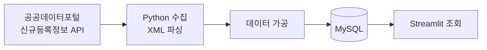
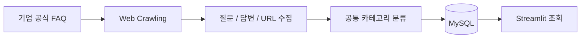
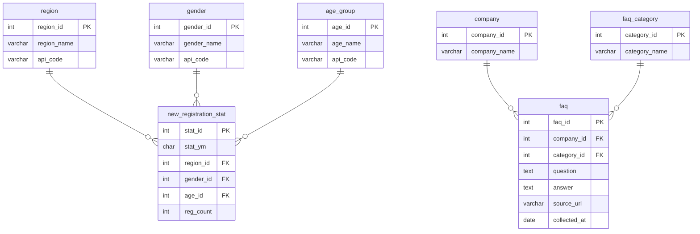
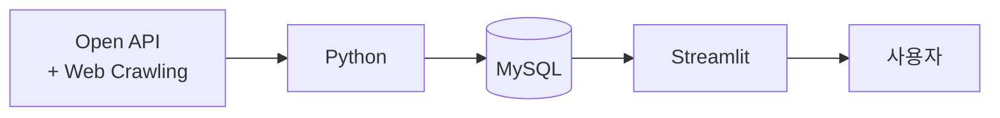

> 이 프로젝트는 SK네트웍스 Family AI 캠프 37기 1차 팀 프로젝트(4인)로 진행되었습니다. <\br>
> 원본 저장소: https://github.com/SKNETWORKS-FAMILY-AICAMP/SKN37-1ST-2TEAM

# SKN37-1ST-2TEAM

# 🚗 카데이터 — 전국 자동차 신규등록 현황 및 기업 FAQ 조회 시스템

> SK Networks Family AI CAMP 37기 1차 프로젝트<br>
> 누가, 언제, 어디서 새 차를 등록했을까요?<br>
> 전국 자동차 신규등록 데이터를 조회하고 자동차 기업의 FAQ를 검색할 수 있는 데이터 기반 서비스

---

## 📖 목차

1. [프로젝트 기간](#-프로젝트-기간)
2. [팀원 및 담당 업무](#-팀원-및-담당-업무)
3. [프로젝트 소개](#-프로젝트-소개)
4. [프로젝트 목표](#-프로젝트-목표)
5. [기술 스택](#️-기술-스택)
6. [서비스 구성](#️-서비스-구성)
7. [데이터 처리 과정](#-데이터-처리-과정)
8. [데이터베이스](#️-데이터베이스)
9. [프로젝트 구조](#-프로젝트-구조)
10. [실행 방법](#️-실행-방법)
11. [Data Source](#-data-source)
12. [Project Summary](#-project-summary)
13. [회고](#-회고)

---

## 📅 프로젝트 기간

2026.09.23(수요일) ~ 2026.09.28(월요일)

---

## 👥 팀원 및 담당 업무

| 팀원 | 담당 업무 |
|:---:|---|
| 강유나 | 자동차 신규등록 현황 API 수집 / DB 설계 및 공통 모듈 |
| 박세윤 | 기업 FAQ 조회 - 기아 |
| 신지호 | 웹페이지 제작 (홈 · 자동차 신규등록 현황 · 기업 FAQ 조회) |
| 오원아 | 기업 FAQ 조회 - 현대 | 

---

## 📌 프로젝트 소개

### 프로젝트 개요

본 프로젝트는 **전국 자동차 신규등록 현황**과 **자동차 기업 FAQ 정보**를 하나의 웹 서비스에서 조회할 수 있도록 구현한 데이터 조회 시스템입니다.

자동차 신규등록 현황에서는
**누가(성별·연령대), 언제(연월), 어디서(시도)** 새 자동차를 등록했는지 표와 그래프로 조회할 수 있습니다.

기업 FAQ에서는
**기아 및 현대자동차의 FAQ를 기업별·카테고리별로 조회하고 키워드로 검색**할 수 있습니다.

프로젝트는 **Streamlit, MySQL, 오픈 API, 웹 크롤링**을 기반으로 구현했습니다.

---

## 🎯 프로젝트 목표

- 전국 자동차 신규등록 현황을 조건별로 조회
- 공공데이터 API를 활용한 자동차 신규등록 데이터 수집
- 조회 결과를 그래프로 시각화하여 추이와 비중을 한눈에 파악
- 자동차 기업 FAQ 데이터를 웹 크롤링하여 데이터베이스에 저장
- 기아·현대 FAQ를 공통 카테고리로 통합 관리
- 기업, 카테고리, 키워드 기반 FAQ 검색 기능 제공
- Streamlit을 활용한 웹 기반 데이터 조회 서비스 구현

---

## 🛠️ 기술 스택

| 구분 | 기술 |
|---|---|
| Programming | Python 3.12 |
| Web Application | Streamlit 1.64 |
| Visualization | Altair |
| Database | MySQL 8.2 |
| DB Connection | PyMySQL |
| Data Processing | Pandas |
| Web Crawling | Requests, BeautifulSoup, Selenium |
| Environment | python-dotenv, venv |
| API | 공공데이터포털 Open API |
| Version Control | Git, GitHub |
| Development | VS Code |

---

## 🖥️ 서비스 구성

본 서비스는 총 3개의 페이지로 구성됩니다.

| 페이지 | 주요 기능 |
|---|---|
| 🏠 홈 | 서비스 소개 및 주요 기능 이동 |
| 🚘 자동차 신규등록 현황 | 기간·시도·성별·연령대별 신규등록 현황 조회 및 그래프 |
| ❓ 기업 FAQ 조회 | 기아·현대 FAQ 조회 및 검색 |

### 🏠 홈

서비스 소개 배너와 기능 카드를 통해 각 페이지로 이동할 수 있습니다.


### 🚘 자동차 신규등록 현황

공공데이터포털의 **한국교통안전공단 자동차 신규등록정보** 데이터를 활용합니다.
**상세 데이터 / 그래프** 두 개의 탭으로 구성됩니다.

#### 조회 조건

- 시작 연월 / 끝 연월 (시작은 끝 이전까지만, 끝은 시작 이후부터만 선택 가능)
- 시도
- 성별
- 연령대

#### 상세 데이터 탭

| 항목 | 내용 |
|---|---|
| 연월 | 신규등록 데이터의 연월 |
| 시도 | 자동차 신규등록 지역 |
| 성별 | 남성 / 여성 |
| 연령대 | 연령대 구분 |
| 신규등록 | 해당 조건의 신규등록 대수 |

- 조회 결과의 **신규등록 대수 합계** 표시
- 조회 결과 **CSV 내려받기** 지원

**상세 데이터 탭**


#### 그래프 탭

- 요약 수치: 총 신규등록 · 월평균 · 최근 달 전월 대비 · 최다 시도 / 연령대
- 연월별 신규등록 추이 (선 그래프)
- 연령대별 성별 비교 (묶은 막대 그래프)
- 성별 비중 (도넛 차트)
- 조회 기간 길이에 따라 x축 눈금 자동 조절

> 신규등록은 해당 월에 새롭게 등록된 자동차를 의미합니다.

**그래프 탭**


### ❓ 기업 FAQ 조회

자동차 기업의 공식 FAQ 데이터를 웹 크롤링하여 MySQL 데이터베이스에 저장하고 조회합니다.

#### 대상 기업

- 기아 (33건)
- 현대 (50건)

#### FAQ 카테고리

기업별로 서로 다른 FAQ 메뉴를 공통 카테고리로 통합하여 관리합니다.

| 공통 카테고리 | 기아 | 현대 |
|---|---|---|
| 차량구매 | 차량구매 | 차량구매 |
| 차량정비 | 차량정비 | 차량정비 |
| 홈페이지 | 홈페이지 | 홈페이지 |
| 멤버스 | 기아멤버스 | 블루멤버스 |
| Pleos 계정 | Pleos 계정 | Pleos 계정 |

#### 검색 기능

- 기업 선택
- 카테고리 선택
- 키워드 검색

키워드는 질문과 답변 내용에서 함께 검색하며, 결과는 20개씩 보여주고 "더 보기"로 이어서 확인할 수 있습니다.
검색 결과에는 질문, 답변, 카테고리, 원본 URL, 수집일을 제공합니다.
FAQ 질문을 클릭하면 답변 내용을 펼쳐서 확인할 수 있으며, 원본 FAQ 페이지로 이동할 수 있습니다.


---

## 🔄 데이터 처리 과정

### 자동차 신규등록 데이터



- **수집 범위**: 2016.09 ~ 2026.08 (120개월, 10년)
- **수집 단위**: 17개 시도 × 성별 2 × 연령대 8 = 월 272건
- **총 데이터**: 32,640건
- 전국 합계는 따로 저장하지 않고 17개 시도의 합으로 계산

### 기업 FAQ 데이터



---

## 🗄️ 데이터베이스

- **Database**: `car_faq`
- **문자셋**: `utf8mb4` (Collation `utf8mb4_unicode_ci`)

### ERD



### 설계 포인트

- **코드 테이블에 `api_code` 분리**: 화면 표기(예: 남성)와 API 요구값(예: 남자)이 달라 별도 컬럼으로 관리
- **신규등록 중복 방지**: 연월 · 시도 · 성별 · 연령대 조합에 UNIQUE 제약, 재수집 시 `ON DUPLICATE KEY UPDATE`로 덮어쓰기
- **FAQ 통합 관리**: 기업과 카테고리를 연결하여 하나의 `faq` 테이블에서 관리하며, 동일 기업의 동일 질문은 중복 저장하지 않음
- **DB 접근 공통 모듈화**: 화면은 `db/` 함수만 호출하고 SQL은 직접 다루지 않음

> 테이블 정의서, API · 화면 매핑 등 상세 내용은 [DB 설계서](docs/DB_설계서.md)를 참고하세요.

---

## 📂 프로젝트 구조

```
SKN37-1ST-2TEAM/
│
├── app.py                    # 홈 화면
├── styles.py                 # 공통 스타일 및 UI 함수
│
├── pages/
│   ├── 1_자동차_등록_현황.py
│   └── 2_기업_FAQ_조회.py
│
├── db/
│   ├── connection.py         # DB 연결 · 조회 · 일괄 저장 공통 함수
│   ├── registration.py       # 신규등록 조회 함수
│   └── faq.py                # FAQ 조회 · 검색 함수
│
├── collectors/
│   ├── collect_registration.py   # 신규등록 API 수집
│   ├── crawl_kia.py              # 기아 FAQ 크롤링
│   └── crawl_hyundai.py          # 현대 FAQ 크롤링
│
├── sql/
│   ├── 00_init.sql
│   ├── 01_registration.sql
│   ├── 02_faq.sql
│   └── 03_seed.sql
│
├── dumps/                    # DB 덤프 파일 (car_faq_dump.sql)
├── assets/                   # 로고 · 배너 · 일러스트 이미지
├── .streamlit/               # Streamlit 설정
├── docs/                     # DB 설계서 · ERD
│
├── .env.example
├── .gitignore
├── requirements.txt
└── README.md
```

---

## ⚙️ 실행 방법

### 1. Repository Clone

```bash
git clone https://github.com/SKNETWORKS-FAMILY-AICAMP/SKN37-1ST-2TEAM.git
cd SKN37-1ST-2TEAM
```

### 2. 가상환경 생성 및 활성화

```bash
python -m venv venv

# Windows (PowerShell)
.\venv\Scripts\Activate.ps1

# macOS / Linux
source venv/bin/activate
```

> 프롬프트 앞에 `(venv)` 표시가 보이는지 확인합니다.

### 3. Python 패키지 설치

```bash
pip install -r requirements.txt
```

### 4. 환경변수 설정

`.env.example`을 복사해 프로젝트 루트에 `.env` 파일을 생성하고 값을 채웁니다.

```
DB_HOST=localhost
DB_PORT=3306
DB_USER=root
DB_PASSWORD=YOUR_PASSWORD
DB_NAME=car_faq
MOLIT_API_KEY=YOUR_API_KEY
```

> ⚠️ `.env` 파일은 비밀번호 및 API Key가 포함되므로 GitHub에 업로드하지 않습니다.
> GitHub에는 `.env.example`만 공유합니다.

### 5. Database 준비

**방법 A. 덤프 복원 (권장)**

`dumps/car_faq_dump.sql`에는 7개 테이블 구조와 전체 데이터(신규등록 32,640건 · FAQ 83건)가 들어 있습니다.
덤프에는 DB 생성 명령이 없으므로 `car_faq` DB를 먼저 만든 뒤 복원합니다.

```bash
# 1) DB 생성 (이미 있으면 넘어감)
mysql -u root -p -e "CREATE DATABASE IF NOT EXISTS car_faq DEFAULT CHARACTER SET utf8mb4 COLLATE utf8mb4_unicode_ci"

# 2-a) 복원 - cmd (명령 프롬프트)
mysql -u root -p car_faq < dumps/car_faq_dump.sql

# 2-b) 복원 - PowerShell (PowerShell은 < 를 지원하지 않음)
mysql -u root -p car_faq -e "source dumps/car_faq_dump.sql"
```

> 복원 시 기존 테이블은 지워지고 덤프 내용으로 새로 만들어집니다.
> `mysql` 명령을 찾지 못하면 `"C:\Program Files\MySQL\MySQL Server 8.2\bin\mysql.exe"`처럼 전체 경로로 실행합니다.

**방법 B. 직접 생성 후 수집**

SQL 파일을 다음 순서로 실행합니다.

```
00_init.sql → 01_registration.sql → 02_faq.sql → 03_seed.sql
```

이후 신규등록 데이터를 수집합니다. (일일 호출 한도 때문에 여러 번 나눠 실행하며, 이미 저장된 조합은 건너뜁니다.)

```bash
python -m collectors.collect_registration
```

### 6. Streamlit 실행

```bash
python -m streamlit run app.py
```

> 반드시 **프로젝트 폴더 안에서** 실행합니다. (밖에서 실행하면 `ModuleNotFoundError` 발생)

---

## 📚 Data Source

- **자동차 신규등록 데이터**: 공공데이터포털 – 한국교통안전공단 자동차종합정보 신규등록정보 서비스
- **기업 FAQ 데이터**: 기아 고객센터 FAQ, 현대자동차 고객센터 FAQ

---

## 🚀 Project Summary

본 프로젝트는 공공데이터 API와 웹 크롤링 데이터를 MySQL로 통합하고, Streamlit을 통해 사용자가 자동차 신규등록 현황과 기업 FAQ를 편리하게 조회할 수 있도록 구현한 데이터 기반 웹 서비스입니다.



### 🎬 시연 영상


https://github.com/user-attachments/assets/d9ec4c19-9949-4bf3-8fe3-30e867fd07e9


https://github.com/user-attachments/assets/1cf54f58-dcf9-4ffe-8256-2d5a09ce7b7d


https://github.com/user-attachments/assets/61a42d99-12ea-4e5f-91a9-194f6655eed1


---

## 💬 회고

### 강유나

공공 API로 데이터를 모으고, DB에 저장하고, 화면에 보여주기까지 서비스 하나가 만들어지는 과정을 처음부터 끝까지 직접 해볼 수 있어서 재밌었습니다. 처음에는 데이터를 저장하기만 하면 된다고 생각했는데, 제가 만든 테이블과 공통 모듈을 팀원 모두가 같이 쓰다 보니 작은 변경 하나도 모두에게 영향이 간다는 걸 알게 되었습니다. 특히 처음으로 팀장을 맡으면서, 코드를 짜기 전에 기획서와 설계서를 정리하고 팀원들과 방향과 규칙을 먼저 맞추는 일이 얼마나 중요한지 느껴졌습니다.

개발 과정에서는 신규등록 API가 호출 한 번에 숫자 하나만 돌려주기 때문에 10년치를 모으려면 32,640번을 호출해야 했는데, 수집을 오래 돌리다 보니 서버가 연결을 강제로 끊는 ConnectionResetError가 발생해 프로그램이 종료되거나, 정상 응답 대신 SERVICETIMEOUT_ERROR가 담긴 응답이 오는 문제가 있었습니다. 이를 해결하기 위해 응답에 결과 코드가 있는지 먼저 확인해 예상하지 못한 응답이 오면 그때까지 모은 값을 저장한 뒤 멈추도록 하고, 500건마다 중간 저장을 하면서 다시 실행하면 이미 저장된 조합은 건너뛰고 남은 조합부터 이어서 수집하도록 만들었습니다. 덕분에 연결이 끊겨 프로그램이 종료되더라도 마지막 중간 저장 이후의 데이터만 다시 받으면 됐고, 여러 번 나눠 실행해 중복 없이 데이터를 모두 수집할 수 있었습니다.
이렇게 수집 중에 연결이 끊기거나 병합하다 코드가 사라지는 것처럼 예상하지 못한 문제도 많았는데, 그때마다 짐작하기보다 원인을 직접 확인하면서 하나씩 해결하다 보니 문제를 대하는 방법을 배울 수 있었습니다. 팀원분들 덕분에 끝까지 완성할 수 있었던 뜻깊은 경험이었습니다.

### 박세윤

비전공자로서 첫 프로젝트라 처음에는 어렵고 막막한 부분이 많았지만, 팀원분들이 많이 도와주셔서 하나씩 해결해 나갈 수 있었습니다. 직접 기아 FAQ 데이터를 수집하고 정리해 기능으로 구현해보면서 수업에서 배운 내용을 실제 프로젝트에 적용하는 경험을 할 수 있었습니다.
개발 과정에서는 웹 크롤링 데이터 수집과 MYSQL 정리를 모두 마쳤음에도 Streamlit에서 데이터가 정상적으로 불러와지지 않는 문제가 발생했는데, 처음에는 코드나 MySQL 연결 문제라고 생각해 여러 부분을 확인했지만, 실제 원인은 .env.example만 있고 실제 환경변수를 저장하는 .env 파일이 없었던 것이 문제였습니다. 이후 .env 파일을 생성하고 DB 접속 정보를 설정하면서 문제를 해결할 수 있었습니다.
이 과정을 통해 코드뿐만 아니라 실행 환경과 설정 파일까지 함께 확인하는 것이 중요하다는 점을 배웠고, 협업의 중요성도 많이 느낄 수 있었습니다. 앞으로는 부족한 부분을 더 공부해 다음 프로젝트에서는 조금 더 주도적으로 참여하고 싶습니다.

### 신지호

팀장님과 다른 팀원분들과 잘 협업한 덕분에 첫 프로젝트를 무사히 마쳤습니다. streamlit으로 웹페이지 제작 파트를 담당했는데 프로젝트 진행 중 가장 힘들었던 부분은 데이터에서 어떤 요소를 그래프로 보여줄지, 보여준다면 어떤 그래프를 이용해서 보여줄지에 대한 부분에서 많이 고민했으나, 팀원분들과 의논하면서 잘 정리했습니다. 덕분에 정말 재밌고 뜻깊은 경험을 하였습니다.

### 오원아

웹 크롤링 데이터를 MySQL로 통합한 뒤, Streamlit으로 대시보드를 구현하여 현대 기업 FAQ를 조회할 수 있도록 만드는 과정이 흥미로웠습니다. 처음에는 다른 팀원들의 데이터가 로컬에 저장되어 있지 않아서 각 팀원들의 데이터를 따로 다운로드 받아야 하는 점들이 조금은 불편하였지만, 각 팀원들께서 자신들의 데이터를 따로 공유해주신 덕분에 통합적인 대시보드를 구현할 수 있게 되어 이슈를 해결한 과정이 있었습니다. 이렇게 팀원들이 잘 협업하여 완성된 대시보드를 구현하여 뜻깊은 시간을 보낼 수 있게 되어 뿌듯했습니다. 그리고 웹 크롤링을 통해 기업 FAQ 페이지를 구현하는 과정을 직접 경험하며, 생성형 AI, MySQL, Streamlit 툴을 잘 협업하여 의미있는 페이지를 구현하는 것을 배우게 되는 소중한 경험이였습니다.
